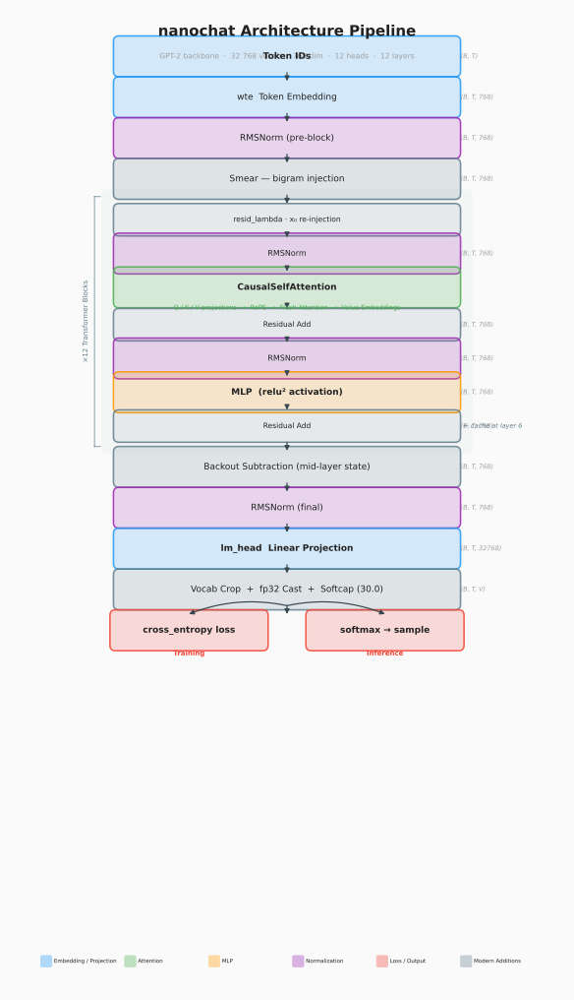
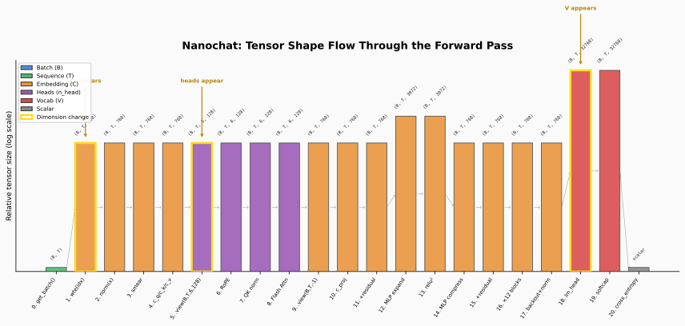

# nanochat Learning Journal
*Building an LLM from scratch — concepts, code, and intuition*

> **How to use this document**
> Each phase maps to the nanochat build roadmap. Every code block is annotated:
> - `# [PT]` = PyTorch built-in — comes from the library, just use it
> - `# [NC]` = nanochat custom — Karpathy wrote it, understand every line
>
> Shape traces show tensor dimensions at each step: `(B, T) → (B, T, C)`
> where B = batch size, T = sequence length (time), C = channels (embedding dim)

---

## Architecture Overview — The Full nanochat Pipeline



*The complete nanochat data flow — from token IDs through 12 transformer blocks to logits. Every phase in this journal corresponds to a coloured region above.*

### Reading the diagram

| Colour | Region | Covered in |
|--------|--------|-----------|
| **Blue** | Input token IDs → `wte` embedding table → positional encoding | Phase 1 (token IDs) + Phase 2 (embeddings) |
| **Green** | N × Transformer Blocks (self-attention + layer norm + FFN + residuals) | Phase 3 + Phase 4 |
| **Red** | `lm_head` output projection → logits | Phase 5 |
| **Black** | Operations: `+` addition, cross-entropy loss | Phase 5 |

### Shape trace — left to right across the diagram

```
Input Token IDs   (B, T)           int64   ← get_batch() output, Phase 1
       ↓  wte = nn.Embedding(vocab_size, C)          [PT]
Token Embeddings  (B, T, C)        float   ← each integer → 384-dim vector
       ↓  + positional encoding    (T, C)
Embeddings        (B, T, C)        float   ← tokens now know their position
       ↓  × N Transformer Blocks
Context Vectors   (B, T, C)        float   ← same shape, much richer meaning
       ↓  lm_head = nn.Linear(C, vocab_size, bias=False)  [PT]
Output Logits     (B, T, vocab_size) float ← one score per possible next token
       ↓  F.cross_entropy(logits, targets)               [PT]
Loss              scalar           float   ← compared against Target Token IDs (B, T)

B = batch_size (12)   T = block_size (1024)   C = n_embd (384)
vocab_size = 50,257   N = n_layer (6)

Note on naming: C and n_embd mean the same thing — the embedding dimension (384).
C is used in shape comments throughout this document (shorter).
n_embd is used in GPTConfig and in nanochat's actual code.
You will see both — they are identical.
```

### The two places vocab_size appears (highlighted in diagram)

- **Place 1 — Embedding Table** `(50,257 × 384)`: `self.wte = nn.Embedding(vocab_size, n_embd)` — one learnable row per token
- **Place 2 — Output Projection** `(384 → 50,257)`: `self.lm_head = nn.Linear(n_embd, vocab_size, bias=False)` — maps back to vocabulary scores

These are the only two places `vocab_size` touches the model. Everything in between operates at dimension `C = 384`.

### Key architectural observations

- **Shape is preserved through all transformer blocks** — input `(B, T, C)` and output `(B, T, C)` are identical. Each block refines meaning without changing dimensions.
- **Residual connections** (the curved arrows looping back in the green region) ensure gradients flow cleanly all the way back to the embedding layer during training.
- **The transformer blocks are the expensive part** — `wte` and `lm_head` are single matrix lookups. The 6 stacked blocks with multi-head attention are where the compute lives.

### ★ The Complete Dimension Trace — get_batch() to attention scores

*This is the single most important reference table in this journal. It traces every shape change from raw token IDs all the way to the `(B, 6, T, T)` attention score matrix inside CausalSelfAttention. Memorise this and the entire model becomes readable.*

| Step | Operation | Shape | Notes |
|------|-----------|-------|-------|
| 0 | `get_batch()` `[NC]` | `(B, T)` | `(12, 1024)` int64 — raw token IDs |
| 1 | `wte(idx)` `[PT]` | `(B, T, C)` | `(12, 1024, 384)` — **C=384 appears. 2D→3D** |
| 2 | `+ wpe(pos)` `[PT]` | `(B, T, C)` | `(12, 1024, 384)` — shape unchanged |
| 3 | `c_attn(x)` `[PT]` | `(B, T, 3C)` | `(12, 1024, 1152)` — Q+K+V fused. C triples |
| 4 | `.split(384, dim=2)` `[PT]` | `q,k,v: (B, T, C)` | `(12, 1024, 384)` × 3 tensors |
| 5 | `.view(B, T, 6, 64)` `[PT]` | `(B, T, n_h, d_h)` | `(12, 1024, 6, 64)` — **4D! heads labelled** |
| 6 | `.transpose(1, 2)` `[PT]` | `(B, n_h, T, d_h)` | `(12, 6, 1024, 64)` — heads → dim 1 |
| 7★ | `q @ k.T(-2,-1)` `[PT]` | `(B, n_h, T, T)` | `(12, 6, 1024, 1024)` — **75M scores!** |
| 8 | `× 1/√64` `[NC]` | `(B, n_h, T, T)` | scaled — prevents softmax collapse |
| 9 | `masked_fill(-∞)` `[PT]` | `(B, n_h, T, T)` | future positions zeroed |
| 10 | `softmax(dim=-1)` `[PT]` | `(B, n_h, T, T)` | weights sum to 1.0 per row |
| 11 | `att @ v` `[PT]` | `(B, n_h, T, d_h)` | `(12, 6, 1024, 64)` — weighted value sum |
| 12 | `.transpose(1,2)` `[PT]` | `(B, T, n_h, d_h)` | `(12, 1024, 6, 64)` — heads back to dim 2 |
| 13 | `.view(B, T, 384)` `[PT]` | `(B, T, C)` | `(12, 1024, 384)` — 6×64 concatenated |
| 14 | `c_proj` `[PT]` | `(B, T, C)` | `(12, 1024, 384)` — **heads mixed. synthesis complete ✓** |

`B=12  ·  T=1024  ·  C=n_embd=384  ·  n_h=n_head=6  ·  d_h=head_dim=64  ·  V=vocab_size=50257`

**Three moments a new dimension appears:**
1. Step 1 `wte` — C=384 appears. Tensor goes 2D → 3D.
2. Step 5 `.view()` — n_head and head_dim appear. Tensor goes 3D → 4D.
3. Step 7 `q@k.T` — second T appears. The 64 dims cancel → T×T scores.

**After Step 14, this `(B, T, 384)` flows back to the Block's residual addition:**
```python
x = x + self.attn(self.ln_1(x))   # [NC]  x: (B,T,384) throughout
x = x + self.mlp(self.ln_2(x))    # [NC]  shape never changes
# → repeat × 6 blocks
# → ln_f → lm_head → (B, T, 50257) logits
```

---

> **🔧 Actual nanochat** (`nanochat/gpt.py:28-39`)
>
> The real GPTConfig differs from the simplified version above:

```python
@dataclass
class GPTConfig:
    sequence_len: int = 2048      # not 1024
    vocab_size: int = 32768       # not 50,257
    n_layer: int = 12
    n_head: int = 6
    n_kv_head: int = 6            # GQA support — new
    n_embd: int = 768             # not 384
    window_pattern: str = "SSSL"  # sliding window — new
```

- **Larger model**: 768-dim embeddings (not 384), 12 layers (not 6), 2048 context (not 1024)
- **Smaller vocab**: 32,768 tokens (custom tokeniser) vs GPT-2's 50,257
- **`n_kv_head`**: enables Grouped Query Attention — keys/values can use fewer heads than queries, saving memory. Here `n_kv_head == n_head` so it's standard MHA, but the plumbing is ready for GQA
- **`window_pattern`**: controls which layers use sliding-window attention vs full attention (S=sliding, L=long/full). Not present in simplified version
- **No `dropout` or `block_size` fields** — dropout is removed entirely, context length is called `sequence_len`

---

## The Entrance, Exit, and Thinking Style — `wte`, `lm_head`, `n_head`

This is where raw token IDs first meet the neural network's architecture. Three terms define the boundary between tokenisation and computation.

### `wte` — The Entrance

Computers can't do math on words, and raw token IDs (like `50256`) are just arbitrary integers — the number itself carries no meaning. The model needs *vectors* (lists of numbers where proximity encodes meaning).

- **What it is:** A giant lookup table with one learnable row per vocabulary token
- **PyTorch:** `self.wte = nn.Embedding(vocab_size, n_embd)` `# [PT]`
- **Shape:** `(50,257 rows × 384 cols)` = 19.3M learnable parameters
- **How it works:** Token ID `2746` ("model") → go to row 2746 → pull out 384 numbers that encode the *meaning* of that token
- **Why `vocab_size` here:** Every possible token from the tokeniser needs its own unique row. No row = no representation = can't process that token

```
Token ID 2746  →  wte[2746]  →  [0.21, -0.54, 0.88, ..., 0.13]
                                  ↑ 384 numbers representing "model"
```

The 384 numbers are *learned during training* — they start random and gradually shift so that tokens used in similar contexts end up with similar vectors. This is why `king - man + woman ≈ queen` falls out of the geometry.

---

### `lm_head` — The Exit

After 6 transformer blocks have finished "thinking", each token position holds a 384-dim vector of rich contextual meaning. But the model's job is to *predict the next token* — and there are 50,257 possible answers. The 384 numbers need to become 50,257 scores.

- **What it is:** A linear layer that projects 384 dims → 50,257 dims
- **PyTorch:** `self.lm_head = nn.Linear(n_embd, vocab_size, bias=False)` `# [PT]`
- **Shape:** `(384 → 50,257)` — produces one raw score ("logit") per vocabulary token
- **How it works:** Highest logit = model's prediction for the next token
- **Why `vocab_size` here:** The model needs one "exit door" for every word it might want to say

```
Context vector  [0.82, 0.41, ...]   ← 384 numbers after 6 blocks
      ↓  lm_head
Logits          [2.1, 0.3, 8.7, 6.2, ...]   ← 50,257 raw scores
      ↓  softmax
Probabilities   ["the": 3%, "flooded": 31%, "dry": 9%, ...]
      ↓  argmax (or sample)
Prediction      "flooded"
```

> **Weight tying:** In nanochat, `wte.weight` and `lm_head.weight` share the same tensor — the entrance and exit use identical parameters. This halves the parameter count at those two layers and works because the same "meaning geometry" that helps encode tokens also helps predict them.

---

### `n_head` — The Thinking Style

If `n_embd = 384` is the total "brain power" available per layer, `n_head = 6` determines *how that power is divided*.

**The photo analogy:** Imagine looking at a photo of a cat sitting on a mat.

- **1 head:** You look at the whole image at once, trying to understand everything simultaneously
- **6 heads:** Specialist perspectives running in parallel:
  - Head 1 focuses on *colours*
  - Head 2 focuses on *shapes*
  - Head 3 focuses on *relationships* ("cat is **on** the mat")
  - Head 4 focuses on *texture*
  - Head 5 focuses on *foreground vs background*
  - Head 6 focuses on *overall scene*
  - All six combine their findings at the end

**In the model:** `n_head = 6` means the 384-dim embedding is split into 6 chunks of 64 dims each (`384 ÷ 6 = 64`). Each head runs its own independent attention computation on its 64-dim slice, then all 6 outputs are concatenated back to 384.

```
Input:  (B, T, 384)
           ↓  split into 6 heads
Head 1: (B, T, 64)  → attends to grammar relationships?
Head 2: (B, T, 64)  → attends to topic / subject matter?
Head 3: (B, T, 64)  → attends to nearby context?
Head 4: (B, T, 64)  → attends to coreference ("it" = what)?
Head 5: (B, T, 64)  → attends to long-range dependencies?
Head 6: (B, T, 64)  → attends to positional patterns?
           ↓  concatenate all heads
Output: (B, T, 384)   ← same shape as input
```

The model *learns* what each head specialises in — you don't assign roles manually. The split-concatenate structure forces specialisation by limiting each head's capacity to 64 dims instead of 384.

> **The constraint that creates specialisation:** Each head only sees 64 of the 384 dimensions. It *can't* try to track everything — it must develop a focused perspective. Forcing scarcity is what makes the heads diverge.

---

### Summary table

| Term | What it is | Analogy | Shape | PyTorch |
|------|-----------|---------|-------|---------|
| `wte` | Embedding table | Dictionary: ID → coordinates | `(vocab_size, n_embd)` = `(50257, 384)` | `nn.Embedding` `[PT]` |
| `lm_head` | Output projection | Voting booth: pick next word | `(n_embd, vocab_size)` = `(384, 50257)` | `nn.Linear` `[PT]` |
| `n_head` | Attention head count | Team of specialists | splits `n_embd` → `n_head` slices of `head_dim = n_embd // n_head = 64` | `[NC]` split logic |

### The complete shape flow

```
(B, T)         ← integer token IDs from get_batch()
   ↓ wte
(B, T, 384)    ← each ID is now a 384-dim meaning vector            [Entrance]
   ↓ + positional encoding
(B, T, 384)    ← vectors now carry position information
   ↓ × 6 transformer blocks, each with 6 attention heads of dim 64
(B, T, 384)    ← same shape, deeply contextualised meaning           [Thinking]
   ↓ lm_head
(B, T, 50257)  ← 50,257 scores per token position                   [Exit]
   ↓ cross_entropy vs targets (B, T)
scalar loss    ← single number to minimise during training
```

> **🔧 Actual nanochat** (`nanochat/gpt.py:172-175`)
>
> The real `wte`, `lm_head`, and shape trace differ from the simplified versions above:

**`wte`** (`gpt.py:172`):
```python
"wte": nn.Embedding(padded_vocab_size, config.n_embd),
```
- Vocab is **padded to nearest 64** (32,768 → already aligned) for GPU memory efficiency. Tensor cores prefer dimensions divisible by 64.

**`lm_head`** (`gpt.py:175`):
```python
self.lm_head = Linear(config.n_embd, padded_vocab_size, bias=False)
```
- Uses a custom `Linear` class that casts weights to match input dtype (for mixed-precision training)
- **Weights are NOT tied** to `wte` — the simplified version mentions weight tying, but nanochat keeps them separate. Untying adds parameters but lets the entrance and exit learn different representations

**Actual shape trace:**
```
B=batch_size  T=sequence_len=2048  C=n_embd=768  V=vocab_size=32768
n_head=6  n_kv_head=6  head_dim=128 (768/6)

(B, T)          ← token IDs
   ↓ wte
(B, T, 768)     ← 768-dim vectors (not 384)
   ↓ × 12 transformer blocks, each with 6 heads of dim 128
(B, T, 768)     ← contextualised
   ↓ lm_head
(B, T, 32768)   ← 32,768 scores (not 50,257)
   ↓ cross_entropy
scalar loss
```

- **`head_dim = 128`** (768 / 6) — double the simplified version's 64. Larger heads = richer per-head representations

---

## Logits, Softmax, and Cross-Entropy Loss

These three concepts form the output pipeline — everything that happens after the transformer blocks finish processing and the model needs to make a prediction.

### Logits — raw scores before probability

A logit is a raw, unnormalised score. Think of a talent show where 50,257 contestants compete for "next token." The judges (`lm_head`) give each contestant a raw score:

```
"cat"      →   8.7   ← highest score
"sat"      →   6.2
"the"      →   2.1
"a"        →   0.3
"jumped"   →  -1.4   ← negative = unlikely, not impossible
```

These numbers — 8.7, 6.2, 2.1 — are logits. They can be any value, positive or negative. They only tell you the *ranking*, not the probability. They come directly from `lm_head`:

```python
logits = self.lm_head(x)   # [PT] nn.Linear matrix multiply
# x shape:      (B, T, 384)    ← 384-dim context vector per token
# logits shape: (B, T, 50257)  ← one raw score per vocabulary token
# Each score = dot product of context vector with one vocab row
```

---

### Softmax — turning scores into probabilities

Softmax converts logits into proper probabilities that sum to exactly 1.0. It does this in three operations:

**Step 1 — apply `exp()` to every logit.** Makes everything positive. Also amplifies differences — the gap between 8.7 and 6.2 becomes much larger.
```
exp(8.7)  = 6002.9   ← was biggest, now enormously biggest
exp(6.2)  =  492.7
exp(2.1)  =    8.2
exp(0.3)  =    1.3
exp(-1.4) =    0.25  ← was negative, now just tiny positive
```

**Step 2 — sum all exp() values.**
```
6002.9 + 492.7 + 8.2 + 1.3 + 0.25 = 6505.4
(in practice you sum all 50,257 tokens)
```

**Step 3 — divide each by the sum.** Every value is now between 0 and 1, all summing to exactly 1.0.
```
"cat"    → 6002.9 / 6505.4 = 92.3%   ← was highest, stays highest
"sat"    →  492.7 / 6505.4 =  7.6%
"the"    →    8.2 / 6505.4 =  0.1%
"jumped" →    0.25 / 6505.4 = 0.004%
```

> **Key property:** Softmax never changes the ranking — the highest logit always becomes the highest probability. It only rescales the numbers into a valid probability distribution.

```python
probs = F.softmax(logits[:, -1, :], dim=-1)   # [PT]
#                          ^^
#                    -1 = last token position (the "predict next" slot)
#       dim=-1 = apply softmax across the vocab dimension (50257)
# Result: (B, 50257) probabilities summing to 1.0
```

---

### Cross-entropy loss — measuring how wrong the model is

After softmax, the model has a probability distribution over 50,257 tokens. Cross-entropy answers: **how wrong is it?**

The formula is simpler than it sounds:
```
loss = -log(probability assigned to the correct token)
```

That's it. You ignore every other token. Just look at what probability the model gave to the word that *actually* came next in the training text, and take the negative log of it.

**Why negative?** `log()` of a number between 0 and 1 is always negative. The negative sign flips it positive so loss is always ≥ 0.

**Why log?** It punishes confident wrong answers exponentially harder than uncertain ones:

```
Model gave correct token 95% probability  →  -log(0.95) = 0.05   ← tiny loss, good
Model gave correct token 50% probability  →  -log(0.50) = 0.69   ← medium loss
Model gave correct token  1% probability  →  -log(0.01) = 4.61   ← high loss, bad
Model gave correct token  0% probability  →  -log(0.00) = ∞      ← catastrophic
```

The loss is the single number that flows backward through every layer during training. Every weight nudges itself slightly to make this number smaller. That process is backpropagation — training.

---

### Why NOT softmax before cross-entropy?

```python
# WRONG — floating point danger
probs = F.softmax(logits, dim=-1)        # softmax first
loss  = F.cross_entropy(probs, targets)  # then loss
# Problem: softmax produces numbers like 0.9999997
# log(0.9999997) loses floating point precision
# Tiny errors accumulate across B*T examples

# CORRECT — PyTorch fuses them internally
loss = F.cross_entropy(logits, targets)  # [PT] raw logits directly
# F.cross_entropy applies log-softmax in one numerically stable operation
# No intermediate rounding errors
```

---

### The full output pipeline in nanochat code

```python
# ── TRAINING ────────────────────────────────────────────────────

logits = self.lm_head(x)             # [PT] (B, T, 50257) raw scores

loss = F.cross_entropy(              # [PT] softmax + log + negate, fused
    logits.view(-1, vocab_size),     # [NC] (B*T, 50257) — flatten for PyTorch
    targets.view(-1)                 # [NC] (B*T,)       — flatten targets
)
# Returns one scalar — the average loss across all B*T token predictions

loss.backward()   # [PT] nudge every weight to reduce this number


# ── INFERENCE (generating text) ──────────────────────────────────

last_logits = logits[:, -1, :]            # [NC] (B, 50257) — last position only
probs = F.softmax(last_logits, dim=-1)    # [PT] convert to probabilities

# Option A — greedy: always take the most likely token (deterministic)
next_token = probs.argmax(dim=-1)         # [PT] always same output

# Option B — sampling: randomly pick weighted by probability (creative)
next_token = torch.multinomial(probs, 1)  # [PT] different output each run

# Append predicted token and feed back in for next prediction
idx = torch.cat([idx, next_token], dim=1) # [PT] autoregressive loop
```

**The key difference between training and inference:**
- Training: use all T positions simultaneously, compare against `targets`, compute loss
- Inference: only use the *last* position's logit (`logits[:, -1, :]`), there are no targets, softmax to pick next token

> **🔧 Actual nanochat** (`nanochat/gpt.py:468-478`)
>
> The real logit computation and loss differ from the simplified version above:

**Logit computation** (`gpt.py:468-472`):
```python
softcap = 15
logits = self.lm_head(x)
logits = logits[..., :self.config.vocab_size]  # remove padding
logits = logits.float()
logits = softcap * torch.tanh(logits / softcap)  # squash logits
```
- **Padding removal**: `lm_head` outputs `padded_vocab_size` columns but only `vocab_size` are real tokens — the rest are sliced off
- **Logit softcapping**: `tanh(logits / 15) * 15` squashes all logits into the range `[-15, 15]`. This prevents any single token from dominating with an extreme score. Technique borrowed from Gemma 2 — stabilises training by bounding the logit magnitudes
- **Cast to float**: ensures loss computation happens in full precision even during mixed-precision training

**Loss** (`gpt.py:474-478`):
```python
loss = F.cross_entropy(
    logits.view(-1, logits.size(-1)), targets.view(-1),
    ignore_index=-1, reduction=loss_reduction
)
```
- **`ignore_index=-1`**: tokens marked with target `-1` are excluded from the loss. Used for padding tokens or prompt tokens during fine-tuning where you only want to train on the completion
- **`loss_reduction`**: configurable (e.g., `'mean'` vs `'none'`) — useful for per-token loss analysis or custom training schemes

---

### Attention scores — a preview for Phase 3

You asked about attention scores in the context of masking. Here is the one-paragraph version — Phase 3 will build this up fully with concrete numbers.

When the model processes "The cat sat on the mat", every token needs to ask every other token: **"how relevant are you to understanding me?"** It computes a pairwise relevance score between every token pair — token 0 vs token 1, token 0 vs token 2, and so on. These are attention scores.

The **causal mask** sets certain scores to `-∞` before softmax — specifically any score where a token tries to look *forward* in time. After softmax, `-∞` becomes zero probability, so future tokens contribute nothing. Token 2 ("sat") can attend to tokens 0 and 1 but not 3, 4, 5.

```
Attention score matrix for a 5-token sequence (✓ = allowed, ✗ = masked to -∞):

            "The"  "cat"  "sat"  "on"   "mat"
"The"   →  [  ✓      ✗      ✗      ✗      ✗  ]   can only see itself
"cat"   →  [  ✓      ✓      ✗      ✗      ✗  ]   sees The, cat
"sat"   →  [  ✓      ✓      ✓      ✗      ✗  ]   sees The, cat, sat
"on"    →  [  ✓      ✓      ✓      ✓      ✗  ]   sees The..on
"mat"   →  [  ✓      ✓      ✓      ✓      ✓  ]   sees everything

This is torch.tril() — a lower triangular matrix of ones.
Everything above the diagonal = -∞ before softmax = 0 after softmax.
```

In nanochat this mask is created once in `__init__` and reused every forward pass:
```python
self.register_buffer(                          # [PT] saves tensor with model
    'bias',
    torch.tril(torch.ones(block_size, block_size))  # [PT] lower triangular
)
# shape: (1024, 1024) — T × T matrix of 1s below diagonal, 0s above
```

Full treatment — Q, K, V, the score computation, why it works — in Phase 3.

---

## ★ Quick Reference — Complete Dimension Trace

*The single most useful table in this journal. Every shape change in the entire model, in order. Pin this mentally — once you know it, all of nanochat's code becomes readable.*



*Each bar shows the total tensor size at that step. Gold borders mark the three moments a new dimension appears.*

### From get_batch() to attention scores (inside CausalSelfAttention)

| Step | Operation | Shape | Notes |
|------|-----------|-------|-------|
| 0 | `get_batch()` `[NC]` | `(B, T)` | `(12, 1024)` int64 — raw token IDs |
| 1 | `wte(idx)` `[PT]` | `(B, T, C)` | `(12, 1024, 384)` — **C=384 appears. 2D→3D** |
| 2 | `+ wpe(pos)` `[PT]` | `(B, T, C)` | `(12, 1024, 384)` — position added. shape unchanged |
| 3 | `c_attn(x)` `[PT]` | `(B, T, 3C)` | `(12, 1024, 1152)` — Q+K+V fused. **C triples** |
| 4 | `.split(384, dim=2)` `[PT]` | `q,k,v: (B,T,C)` | `(12, 1024, 384)` × 3 — separated |
| 5 | `.view(B,T,6,64)` `[PT]` | `(B, T, n_h, d_h)` | `(12,1024,6,64)` — **4D! heads labelled** |
| 6 | `.transpose(1,2)` `[PT]` | `(B, n_h, T, d_h)` | `(12,6,1024,64)` — heads → dim 1 |
| 7★ | `q @ k.T(-2,-1)` `[PT]` | `(B, n_h, T, T)` | `(12,6,1024,1024)` — **64 cancels → T×T scores** |
| 8 | `× 1/√64` `[NC]` | `(B, n_h, T, T)` | scaled — prevents softmax collapse |
| 9 | `masked_fill(-∞)` `[PT]` | `(B, n_h, T, T)` | future positions zeroed |
| 10 | `softmax(dim=-1)` `[PT]` | `(B, n_h, T, T)` | weights sum to 1.0 per row |
| 11 | `att @ v` `[PT]` | `(B, n_h, T, d_h)` | `(12,6,1024,64)` — weighted value sum |
| 12 | `.transpose(1,2)` `[PT]` | `(B, T, n_h, d_h)` | `(12,1024,6,64)` — heads back to dim 2 |
| 13 | `.view(B,T,384)` `[PT]` | `(B, T, C)` | `(12,1024,384)` — 6×64 concatenated |
| 14 | `c_proj` `[PT]` | `(B, T, C)` | `(12,1024,384)` — **heads mixed. synthesis ✓** |

### From CausalSelfAttention output to loss (the full model)

| Step | Operation | Shape | Notes |
|------|-----------|-------|-------|
| 14 | `c_proj output` | `(B, T, C)` | back in Block.forward() |
| 15 | `x = x + attn_out` `[NC]` | `(B, T, C)` | residual addition |
| 16 | `mlp(ln_2(x))` `[NC]` | `(B, T, C)` | FFN: 384→1536→384 per token |
| 17 | `x = x + mlp_out` `[NC]` | `(B, T, C)` | residual addition |
| 18 | `× 6 blocks total` | `(B, T, C)` | **shape never changes through any block** |
| 19 | `ln_f(x)` `[PT]` | `(B, T, C)` | normalise residual stream — only time |
| 20★ | `lm_head(x)` `[PT]` | `(B, T, V)` | `(12,1024,50257)` — **V=50257 appears** |
| 21 | `F.cross_entropy` `[PT]` | `scalar` | one number — minimise this |

`B=12  ·  T=1024  ·  C=n_embd=384  ·  n_h=n_head=6  ·  d_h=head_dim=64  ·  V=vocab_size=50257`

**Two shape changes in the entire model:**
1. Step 1 — `wte`: `(B,T)` → `(B,T,384)` — C appears
2. Step 20 — `lm_head`: `(B,T,384)` → `(B,T,50257)` — V appears

**Everything between operates at exactly `(B, T, 384)` — always.**

---

## PyTorch Built-ins Quick Reference
*Populated as we go — one entry per new built-in encountered*

| API | What it does | First seen |
|-----|-------------|-----------|
| `torch.tensor(data, dtype=)` | Convert Python list/array to tensor | Phase 1 |
| `torch.randint(high, size)` | Random integers — used for batch sampling | Phase 1 |
| `torch.stack([t1, t2, ...])` | Stack list of 1D tensors into 2D matrix | Phase 1 |
| `torch.from_numpy(arr)` | Convert numpy array to tensor (shares memory) | Phase 1 |
| `.to(device)` | Move tensor to CPU or GPU | Phase 1 |
| `nn.Embedding(num, dim)` | Lookup table: integer → row of weight matrix | Phase 1 (referenced) |
| `nn.Linear(in, out, bias=)` | Fully connected layer: y = xWᵀ + b | Phase 1 (referenced) |
| `F.cross_entropy(logits, targets)` | Loss: softmax + log + negate, fused and stable | Arch overview |
| `F.softmax(x, dim=)` | Convert logits to probabilities summing to 1 | Arch overview |
| `probs.argmax(dim=)` | Index of highest value — greedy decoding | Arch overview |
| `torch.multinomial(probs, n)` | Sample index weighted by probabilities | Arch overview |
| `torch.cat([t1, t2], dim=)` | Concatenate tensors along a dimension | Arch overview |
| `torch.tril(torch.ones(T, T))` | Lower triangular matrix — the causal mask | Arch overview |
| `self.register_buffer(name, tensor)` | Save tensor with model, not a trainable parameter | Arch overview |
| `nn.Dropout(p)` | Zero random fraction of values during training | Phase 2 |
| `nn.ModuleDict(dict)` | Named dict of layers — PyTorch tracks all as parameters | Phase 2 |
| `nn.ModuleList([...])` | Ordered list of layers — PyTorch tracks all as parameters | Phase 2 |
| `nn.LayerNorm(dim)` | Normalise vector to mean=0, std=1 — training stability | Phase 2 |
| `nn.GELU()` | Smooth activation function — like ReLU but fades near 0 | Phase 2 |
| `torch.arange(n, device=)` | Create tensor `[0, 1, 2, ..., n-1]` | Phase 2 |
| `torch.nn.utils.clip_grad_norm_(params, max)` | Cap gradient vector magnitude — prevents explosions | Phase 2 |
| `torch.optim.AdamW(params, lr, weight_decay)` | Optimiser: Adam + correct weight decay | Phase 2 |
| `tensor.view(*shape)` | Reshape without copying — relabels memory layout | Phase 3.1 |
| `tensor.transpose(dim_a, dim_b)` | Swap two dimensions — used to move heads to dim 1 | Phase 3.1 |
| `tensor.split(size, dim)` | Split tensor into equal chunks along a dimension | Phase 3.1 |
| `@` / `torch.matmul(a, b)` | Batched matrix multiply — runs all heads in parallel | Phase 3.1 |
