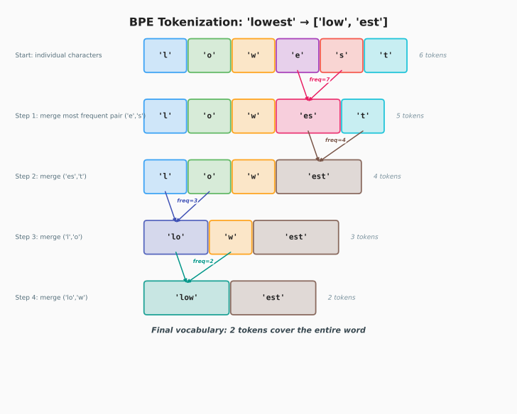

---

## Phase 1 — Tokenisation
*How raw text becomes integer tensors the model can process*

### The problem tokenisation solves

A neural network can only work with numbers. Raw text must become a sequence of integers before any matrix multiplication can happen. The tokeniser is the bridge — it sits entirely outside the PyTorch model, has no trainable parameters, and runs once before training.

```
"Hello world"  →  [15496, 995]  →  nn.Embedding  →  (2, 384) float tensor
    text           token IDs          [PT]            model input
```

Three vocabulary strategies exist, each a trade-off between vocabulary size and tokens-per-word:

| Strategy | Vocab size | Tokens for "unhappiness" | Used in |
|----------|-----------|--------------------------|---------|
| Character-level | 65 (Shakespeare) | 11 (one per char) | nanogpt demo |
| BPE subword | 50,257 | 3 (`un`, `happiness`, end) | nanochat / GPT-2 |
| Word-level | millions | 1 | almost never |

**The context window trade-off:** character-level uses ~4× more tokens than BPE for the same text. A 1024-token context window holds ~930 characters at char-level vs ~4000 characters at BPE. This is the primary reason real LLMs use BPE.

---

### 1.1 — BPE (Byte Pair Encoding)

#### The problem — three bad vocabulary options

Before BPE, there were three naive approaches, each with a fatal flaw:

```
Option A — Word-level vocabulary:
  "unhappiness" and "happiness" → completely separate rows in embedding table
  Share zero information despite sharing meaning.
  1 million unique words = 1 million rows = massive table.
  New words at inference ("GPT-4ish") get no embedding → unknown token problem.

Option B — Character-level vocabulary:
  Only 256 tokens (one per ASCII character).
  "hello" = 5 tokens. Context window fills fast.
  "unhappiness" = 11 tokens vs 3 in BPE → 4× less text per context window.

Option C — BPE subword (the solution):
  Learns which character combinations are worth merging from your actual data.
  "unhappiness" → ["un", "happiness"] — shares "happiness" with "happy".
  Small vocab (50,257), efficient tokens (~4 chars each), handles new words.
```

#### The core idea

BPE is greedy statistics, nothing more. Start with individual characters, repeatedly find the most frequent adjacent pair in your corpus, merge it into a new token, repeat until you hit your target vocabulary size. The ordered list of merge rules that results IS the tokeniser.

#### The algorithm step by step



*BPE in action: "lowest" goes from 6 characters to 2 tokens through repeated most-frequent-pair merges.*

**Starting corpus** (with end-of-word marker `Ġ`):

```
"low"    → l o w Ġ
"lower"  → l o w e r Ġ
"newest" → n e w e s t Ġ
```

**Initial vocabulary:** just the 9 unique characters: `l o w e r n s t Ġ`

**Counting all adjacent pairs before Merge 1:**

| Pair | Appears in | Count |
|------|-----------|-------|
| `l + o` | "low", "lower" | **2 ← winner** |
| `o + w` | "low", "lower" | 2 (tie — l+o wins first) |
| `w + e` | "lower", "newest" | 2 |
| `w + Ġ` | "low" | 1 |
| `e + r` | "lower" | 1 |
| `e + s` | "newest" | 1 |

**Merge 1:** `l+o` wins — appears twice.
```
l o w Ġ       →  lo w Ġ
l o w e r Ġ   →  lo w e r Ġ
n e w e s t Ġ →  n e w e s t Ġ   (unchanged)
```
Vocabulary grows to 10: adds `lo`

**Merge 2:** `lo+w` now appears twice — wins.
```
lo w Ġ       →  low Ġ
lo w e r Ġ   →  low e r Ġ
```
Vocabulary grows to 11: adds `low`

**After many merges**, `"lowering"` (a word never seen in training) still tokenises cleanly:
```
"lowering" → low + er + ing + Ġ
```
`"low"` is shared across "low", "lower", "lowering", "lowest" — their embeddings start from the same token. Meaning is shared by construction. This is why BPE beats word-level vocabulary.

#### From-scratch Python implementation

```python
# [NC] All code below is nanochat custom — plain Python, no PyTorch
from collections import Counter

def get_pairs(vocab):
    """Count all adjacent pairs across the whole corpus."""
    pairs = Counter()
    for word, freq in vocab.items():
        symbols = word.split()
        for i in range(len(symbols) - 1):
            pairs[(symbols[i], symbols[i+1])] += freq
    return pairs

def merge_vocab(pair, vocab):
    """Replace all occurrences of the winning pair with the merged token."""
    new_vocab = {}
    bigram = ' '.join(pair)
    replacement = ''.join(pair)
    for word in vocab:
        new_word = word.replace(bigram, replacement)
        new_vocab[new_word] = vocab[word]
    return new_vocab

# Initial vocab: each word as space-separated chars, with frequency
vocab = {
    'l o w Ġ':      5,   # "low" appears 5 times in corpus
    'l o w e r Ġ':  2,
    'n e w e s t Ġ': 6,
    'w i d e r Ġ':   3,
}

num_merges  = 10
merge_rules = []          # this ordered list IS the tokeniser

for i in range(num_merges):
    pairs = get_pairs(vocab)
    best  = max(pairs, key=pairs.get)   # most frequent pair
    vocab = merge_vocab(best, vocab)
    merge_rules.append(best)
    print(f"Merge {i+1}: {best[0]!r} + {best[1]!r} → {''.join(best)!r}")

# Encoding new text: apply merge rules in order
def tokenise(text, merge_rules):
    words  = text.split()
    tokens = [' '.join(list(w)) + ' Ġ' for w in words]
    for (a, b) in merge_rules:
        tokens = [t.replace(f'{a} {b}', f'{a}{b}') for t in tokens]
    result = []
    for t in tokens:
        result.extend(t.split())
    return result

tokenise("low lower", merge_rules)
# → ['lowĠ', 'low', 'erĠ']
#    ↑ complete word   ↑ two tokens sharing 'low'
```

**Key insight:** `merge_rules` is a plain Python list. Serialise it to disk and you have a complete, reloadable tokeniser — no PyTorch needed.

> **🔧 Actual nanochat** (`nanochat/tokenizer.py`)
>
> nanochat trains its own BPE vocabulary from scratch rather than reusing GPT-2's:
>
> ```python
> # nanochat/tokenizer.py — RustBPETokenizer
> class RustBPETokenizer:
>     """Train with rustbpe (Rust CLI), infer with tiktoken (fast C/Rust)."""
>
>     def encode(self, text, prepend=None, append=None, num_threads=8):
>         # text can be str or list[str]; batch encoding parallelised
>         ...
>
>     def decode(self, ids):
>         return self.enc.decode(ids)
> ```
>
> - **Vocab size: 32,768** (not 50,257). Smaller vocab = smaller embedding table, tuned to nanochat's training data.
> - **Split pattern** — GPT-4 style regex, not GPT-2's:
>   ```python
>   SPLIT_PATTERN = r"""'(?i:[sdmt]|ll|ve|re)|[^\r\n\p{L}\p{N}]?+\p{L}+|\p{N}{1,2}| ?[^\s\p{L}\p{N}]++[\r\n]*|\s*[\r\n]|\s+(?!\S)|\s+"""
>   ```
>   This controls how raw text is pre-split before BPE merges run. The GPT-4 pattern handles numbers and whitespace differently than GPT-2's.
> - **Two-tool pipeline:** `rustbpe` (Rust CLI) trains the merge rules; `tiktoken` loads them at runtime for fast inference. Best of both worlds.

---

### 1.2 — Character-level tokeniser (nanogpt Shakespeare demo)

The simplest possible tokeniser. Vocabulary = every unique character in your training text. No merge rules, no external dependencies — just two Python dicts.

#### The complete implementation

```python
import torch                          # [PT] only needed for tensor conversion

# ── Step 1: build vocab ──────────────────────────────────────────
with open('shakespeare.txt', 'r', encoding='utf-8') as f:
    text = f.read()                   # [NC]

chars     = sorted(list(set(text)))   # [NC] sorted = deterministic mapping
vocab_size = len(chars)               # [NC] 65 for Shakespeare
# sorted() is critical: without it, set() gives random order each run,
# making saved model weights map to wrong characters on reload

# ── Step 2: lookup tables ────────────────────────────────────────
stoi = { ch: i for i, ch in enumerate(chars) }   # [NC] string → int
itos = { i: ch for i, ch in enumerate(chars) }   # [NC] int → string
# stoi['h'] → 34    (integer ID for 'h')
# itos[34]  → 'h'   (back to the character)

# ── Step 3: encode / decode ──────────────────────────────────────
encode = lambda s: [stoi[c] for c in s]            # [NC] str  → list[int]
decode = lambda l: ''.join([itos[i] for i in l])   # [NC] list[int] → str

# round-trip always works:
decode(encode("Hello")) == "Hello"   # True

# ── Step 4: encode entire corpus → tensor ───────────────────────
data = torch.tensor(encode(text), dtype=torch.long)
#      ^^^^^^^^^^^^                  ^^^^^^^^^^^
#      [PT] creates tensor           [PT] long = int64 (required by nn.Embedding)
#                    ^^^^^^^^^^^^^^
#                    [NC] our encode() from step 3
# shape: torch.Size([1115394])  ← 1.1M characters

# ── Step 5: train / val split ────────────────────────────────────
n          = int(0.9 * len(data))   # [NC]
train_data = data[:n]               # [NC]
val_data   = data[n:]               # [NC]

# ── Step 6: batch sampler ────────────────────────────────────────
block_size = 256   # [NC] context length — chars the model sees at once
batch_size = 64    # [NC] independent sequences per batch

def get_batch(split):                                          # [NC]
    d  = train_data if split == 'train' else val_data
    ix = torch.randint(len(d) - block_size, (batch_size,))   # [PT]
    x  = torch.stack([d[i  :i+block_size  ] for i in ix])    # [PT]
    y  = torch.stack([d[i+1:i+block_size+1] for i in ix])    # [PT]
    return x.to(device), y.to(device)                        # [PT]

xb, yb = get_batch('train')
# xb shape: (64, 256)  — integer tensor, each cell is a char ID
# yb shape: (64, 256)  — same, shifted right by 1 (the targets)
```

#### What x and y look like (block_size=8 for clarity)

```
x:  [18, 47, 56, 57, 58,  1, 15, 47]   →  "First Ci"
y:  [47, 56, 57, 58,  1, 15, 47, 58]   →  "irst Cit"

Position 0 says: "given F,       predict i"
Position 1 says: "given Fi,      predict r"
Position 2 says: "given Fir,     predict s"
...
Position 7 says: "given First Ci, predict t"

One sequence of length 256 gives 256 training examples — free!
```

#### PyTorch built-ins used (all in get_batch)

| Call | What it does |
|------|-------------|
| `torch.randint(high, size)` | Randomly picks `batch_size` start positions |
| `torch.stack([...])` | Stacks list of 1D slices into `(B, T)` matrix |
| `.to(device)` | Moves tensor to GPU if `device='cuda'` |

Everything else — `set()`, `sorted()`, `enumerate()`, `lambda`, `dict` — is plain Python with zero PyTorch.

---

### 1.3 — tiktoken (what nanochat actually uses)

tiktoken is not a new algorithm. It is GPT-2's pre-trained BPE tokeniser — 50,000 merge rules trained by OpenAI on web text, shipped as a fast Rust library. The interface mirrors your char tokeniser exactly: `encode()` and `decode()`.

#### Why tiktoken over char-level

| | Char tokeniser | tiktoken GPT-2 |
|---|---|---|
| Vocab size | 65 | 50,257 |
| Chars per token | 1 | ~4 |
| Context window efficiency | poor | 4× better |
| Vocab trained on | your corpus | OpenAI web text |
| External dependency | none | `pip install tiktoken` |

#### Basic usage

```python
import tiktoken                                    # [NC]

enc = tiktoken.get_encoding("gpt2")               # [NC]
# "gpt2"         → 50,257 tokens (nanochat uses this)
# "cl100k_base"  → 100,277 tokens (GPT-4)
# Downloads ~500KB merge rules once, caches in ~/.tiktoken

print(enc.n_vocab)     # 50257
print(enc.eot_token)   # 50256 ← special end-of-text token ID

# encode: string → list of ints
ids = enc.encode("Hello, I'm a language model")   # [NC]
# → [15496, 11, 314, 1101, 257, 3303, 2746]

# decode: list of ints → string
enc.decode(ids)                                   # [NC]
# → "Hello, I'm a language model"

# Inspect individual tokens — very useful for debugging:
for tok_id in ids:
    print(f"{tok_id:6d}  →  {repr(enc.decode([tok_id]))}")
# → 15496  →  'Hello'
# →    11  →  ','
# →   314  →  ' I'     ← note the leading space!
# →  1101  →  "'m"
# →   257  →  ' a'
# →  3303  →  ' language'
# →  2746  →  ' model'
```

> **Spaces are part of tokens.** `' I'` (space + I) is one token. GPT-2's BPE was trained on text where spaces attach to the following word. Always use the same tokeniser your model was trained with — the space convention is baked into the vocabulary.

#### encode_ordinary vs encode — important distinction

```python
# encode() raises ValueError if special tokens appear, unless allowed:
enc.encode("hello <|endoftext|> world",
           allowed_special={"<|endoftext|>"})
# → [31373, 220, 50256, 995]
#              ↑ 50256 = EOT special token ID

# encode_ordinary() — ignores special tokens, treats them as text.
# THIS is what nanochat's prepare.py uses for raw data:
enc.encode_ordinary("hello <|endoftext|> world")  # [NC]
# → [31373, 1279, 91, 437, 1659, 5239, 91, 29, 995]
#    treats <> as regular characters

# nanochat adds EOT between documents manually:
eot    = enc.eot_token                            # [NC] = 50256
doc1   = enc.encode_ordinary("First document...")
doc2   = enc.encode_ordinary("Second document...")
tokens = doc1 + [eot] + doc2                      # [NC]
```

> **🔧 Actual nanochat** (`nanochat/tokenizer.py:13-25`)
>
> nanochat does not use GPT-2's `<|endoftext|>`. It defines its own special tokens for chat structure:
>
> ```python
> SPECIAL_TOKENS = [
>     "<|bos|>",              # beginning of sequence (replaces EOT as document separator)
>     "<|user_start|>", "<|user_end|>",
>     "<|assistant_start|>", "<|assistant_end|>",
>     "<|python_start|>", "<|python_end|>",
>     "<|output_start|>", "<|output_end|>",
> ]
> ```
>
> - These get appended after the 32,768 BPE tokens, so vocab_size = 32,768 + 9 = 32,777.
> - Every document begins with `<|bos|>` instead of being separated by EOT.
> - The chat role tokens (`user_start`, `assistant_start`, etc.) let the model learn conversational turn structure during pre-training.

#### Data preparation — prepare.py (run once before training)

```python
# prepare.py — run ONCE before training, never again            [NC]
import os, tiktoken
import numpy as np

with open('data/input.txt', 'r', encoding='utf-8') as f:
    data = f.read()

enc = tiktoken.get_encoding("gpt2")               # [NC]
ids = enc.encode_ordinary(data)                   # [NC]
# 1M chars ÷ ~4 chars/token ≈ 250K tokens

n        = int(0.9 * len(ids))
train_ids = ids[:n]
val_ids   = ids[n:]

# Save as uint16 — token IDs 0..50256 fit in 2 bytes
# uint16 = 2 bytes/token vs int64 = 8 bytes/token → 4× smaller files
np.array(train_ids, dtype=np.uint16).tofile('data/train.bin')
np.array(val_ids,   dtype=np.uint16).tofile('data/val.bin')
```

#### Loading in the training loop — get_batch with memmap

```python
import torch, numpy as np

# Memory-map — OS loads file pages on demand, doesn't load all into RAM
train_data = np.memmap('data/train.bin', dtype=np.uint16, mode='r')  # [NC]
val_data   = np.memmap('data/val.bin',   dtype=np.uint16, mode='r')  # [NC]

block_size = 1024   # [NC] GPT-2 context length
batch_size = 12     # [NC] tune to your GPU VRAM

def get_batch(split):                                              # [NC]
    data = train_data if split == 'train' else val_data
    ix   = torch.randint(len(data) - block_size, (batch_size,))  # [PT]
    x = torch.stack(                                              # [PT]
        [torch.from_numpy(                                        # [PT]
            data[i  :i+block_size  ].astype(np.int64)
         ) for i in ix]
    )
    y = torch.stack(                                              # [PT]
        [torch.from_numpy(                                        # [PT]
            data[i+1:i+block_size+1].astype(np.int64)
         ) for i in ix]
    )
    return x.to(device), y.to(device)                            # [PT]

xb, yb = get_batch('train')
# xb: torch.Size([12, 1024])  dtype=torch.int64
# yb: torch.Size([12, 1024])  dtype=torch.int64
```

> **Why `.astype(np.int64)` in get_batch?** Files are stored as uint16 (compact). `nn.Embedding` requires int64. The conversion happens here — compact on disk, correct dtype in the model.

> **🔧 Actual nanochat** (`nanochat/dataloader.py`)
>
> nanochat replaces `.bin` files and `np.memmap` with a streaming parquet-based dataloader:
>
> ```python
> # nanochat/dataloader.py — BOS-aligned bestfit dataloader
> def tokenizing_distributed_data_loader_with_state_bos_bestfit(
>     tokenizer, B, T, split, ...):
>     # Reads from parquet files, tokenizes on-the-fly
>     # Handles DDP sharding and resume from checkpoint
>     # Pre-allocates pinned CPU + GPU buffers for efficient transfer
>     ...
> ```
>
> - **Parquet, not `.bin`:** data stays in parquet format; tokenisation happens on-the-fly in the dataloader.
> - **Best-fit document packing:** documents are packed into fixed-length rows using a best-fit algorithm. Every row starts with `<|bos|>`. This gives 100% utilisation (no padding tokens), at the cost of ~35% of tokens being cropped at `T=2048`.
> - **No `np.memmap`:** instead, pinned CPU buffers are pre-allocated and data is streamed directly to GPU. This avoids the random-access page-fault pattern of memmap on large datasets.
> - **DDP-aware:** the dataloader handles multi-GPU sharding natively, so each process sees a disjoint slice of the data.

#### Spaces are part of tokens — an important detail

```python
enc = tiktoken.get_encoding("gpt2")
ids = enc.encode("Hello, I'm a language model")
# → [15496, 11, 314, 1101, 257, 3303, 2746]

# Inspect each token:
# 15496  →  'Hello'
#    11  →  ','
#   314  →  ' I'     ← note the LEADING SPACE — space attaches to following word
#  1101  →  "'m"
#   257  →  ' a'
#  3303  →  ' language'
#  2746  →  ' model'
```

GPT-2's BPE was trained on text where spaces attach to the following word. This is why you must always use the same tokeniser your model was trained with — the space convention is baked into the 50,257-entry vocabulary. Different tokenisers produce different token IDs for identical text.

#### The vocab_size handoff to the model

`vocab_size` is the single number that connects the tokeniser to the model. It determines the size of two things — and only two things:

```python
import tiktoken
import torch.nn as nn                             # [PT]
from dataclasses import dataclass

enc = tiktoken.get_encoding("gpt2")

@dataclass
class GPTConfig:                                  # [NC]
    vocab_size : int = enc.n_vocab   # 50257 ← from tiktoken
    block_size : int = 1024          # context length — max sequence length
    n_layer    : int = 6             # number of transformer blocks stacked
    n_head     : int = 6             # attention heads per block
    n_embd     : int = 384           # embedding dimension (C)
    dropout    : float = 0.1         # dropout probability
# All hyperparameters in one place — clean, readable, easy to change
# To scale up: increase n_layer, n_head, n_embd. vocab_size stays fixed (from tokeniser).

class GPT(nn.Module):                             # [NC] class
    def __init__(self, config):
        super().__init__()                        # [PT]

        # Place 1 — embedding table
        self.wte = nn.Embedding(config.vocab_size, config.n_embd)  # [PT]
        # 50257 rows × 384 cols = 19.3M parameters
        # Each row = learnable vector for one token

        # Place 2 — output projection
        self.lm_head = nn.Linear(config.n_embd, config.vocab_size, bias=False)  # [PT]
        # 384 → 50257 logits (one score per vocab token)
```

#### Complete shape flow — Phase 1 output into the full model

| Operation | Shape | dtype | Notes |
|-----------|-------|-------|-------|
| `get_batch()` | `(B, T)` | int64 | token IDs from train.bin |
| `wte` | `(B, T, 384)` | float32 | one vector per token ← Phase 2 |
| `6× Block` | `(B, T, 384)` | float32 | richer meaning per token |
| `lm_head` | `(B, T, 50257)` | float32 | one logit per vocab token |
| `cross_entropy` | `scalar` | float32 | compared against y targets |

`B = batch_size = 12  ·  T = block_size = 1024  ·  384 = n_embd  ·  50257 = vocab_size`

---

### Phase 1 — Key takeaways

1. **The tokeniser is pure Python** — no PyTorch, no GPU, no training. It runs once on your raw text and produces integer arrays.

2. **Two designs, same interface** — char tokeniser uses `stoi`/`itos` dicts; tiktoken uses compiled Rust. Both expose `encode(str) → list[int]` and `decode(list[int]) → str`.

3. **BPE merge rules are the tokeniser** — not the final vocabulary list. To encode new text, apply each merge rule in order to the character sequence.

4. **vocab_size flows into exactly two model layers** — `nn.Embedding` (input) and `nn.Linear` lm_head (output). Change tokeniser → change both.

5. **dtype discipline** — save as `uint16` (compact), load and convert to `int64` in `get_batch()` (required by `nn.Embedding`).

6. **PyTorch built-ins in Phase 1** — only in `get_batch()`:
   `torch.randint`, `torch.stack`, `torch.from_numpy`, `.to(device)`, `torch.tensor`

> **🔧 Actual nanochat — how it diverges from the simplified code above**
>
> | Aspect | Simplified (this journal) | Actual nanochat |
> |--------|--------------------------|-----------------|
> | Tokenizer | `tiktoken.get_encoding("gpt2")` | `RustBPETokenizer` — custom BPE trained with `rustbpe`, inference via `tiktoken` |
> | Vocab size | 50,257 (GPT-2) | 32,768 + 9 special tokens = 32,777 |
> | Special tokens | `<\|endoftext\|>` (EOT) | `<\|bos\|>`, `<\|user_start\|>`, `<\|assistant_end\|>`, etc. |
> | Data format | `.bin` files via `np.memmap` | Parquet files, tokenised on-the-fly in the dataloader |
> | Batching | Random offset into flat array | Best-fit document packing, BOS-aligned rows, zero padding |
> | Split pattern | GPT-2 regex | GPT-4 style regex (better number/whitespace handling) |
>
> The conceptual flow is identical — text → BPE merge rules → integer IDs → batched tensors → `nn.Embedding`. The differences are all engineering choices for training a chat model at scale vs. a single-file demo.

---
